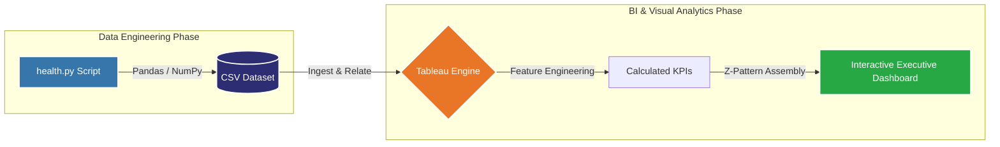
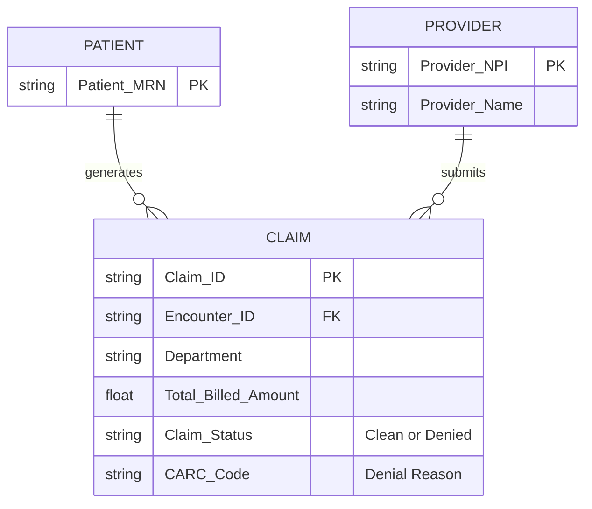

# Enterprise Healthcare Analytics: Revenue Cycle Management Dashboard

### **[Access the Interactive Tableau Dashboard Here](https://lnkd.in/dnMPDKMx)**

<div align="center">
  
  
  
  
  
</div>

<br>

<p align="center">
  
</p>

> **The Bottom Line:** In healthcare, delayed or denied insurance claims trap millions of dollars in accounts receivable (AR). This project is an end-to-end data analytics pipeline designed to identify the root causes of revenue leakage, isolate offending clinical departments, and track $1M+ in at-risk revenue.

---

## Table of Contents
1. [System Architecture & Pipeline](#system-architecture--pipeline)
2. [Phase 1: Data Engineering & Schema](#phase-1-data-engineering--schema)
3. [Phase 2: Business Logic & Calculations](#phase-2-business-logic--calculations)
4. [Phase 3: Visual Analytics & UI/UX](#phase-3-visual-analytics--uiux)
5. [Key Business Insights Discovered](#key-business-insights-discovered)

---

## System Architecture & Pipeline

To simulate a real-world enterprise environment, I bypassed pre-cleaned datasets and built the data pipeline from scratch using Python. This allowed for intentional data anomalies to be generated and later discovered during the visualization phase.



---

## Phase 1: Data Engineering & Schema

I utilized Python to generate 10,000+ realistic hospital billing records. To simulate a real-world operational failure, the Orthopedics department was hardcoded to experience a **40% claim denial rate**, while other departments operated normally.

**Data Generation Logic (Python Snippet):**
```python
# Simulating denial rates heavily weighted toward Orthopedics
import pandas as pd
import numpy as np

def assign_claim_status(department):
    if department == 'Orthopedics':
        return np.random.choice(['Clean', 'Denied'], p=[0.60, 0.40])
    else:
        return np.random.choice(['Clean', 'Denied'], p=[0.95, 0.05])
```

**Entity-Relationship (ER) Data Model:**
Below is the schema mapping of the generated dataset, demonstrating the relationships between providers, patients, and financial claims.



---

## Phase 2: Business Logic & Calculations

Once the raw data was ingested into Tableau, I translated core business requirements into mathematical logic to create actionable Executive KPIs.

**Core Tableau Calculated Fields:**
* **Revenue at Risk:** Isolates capital trapped specifically in denied claims.
  ```sql
  SUM(IIF([Claim Status] = 'Denied', [Total Billed Amount], 0))
  ```
* **Clean Claim Rate:** The percentage of claims successfully paid on the first submission.
  ```sql
  SUM(IIF([Claim Status] = 'Clean', 1, 0)) / COUNT([Claim Status])
  ```
* **Initial Denial Rate:** The inverse of the clean claim rate, highlighting operational friction.
  ```sql
  SUM(IIF([Claim Status] = 'Denied', 1, 0)) / COUNT([Claim Status])
  ```

---

## Phase 3: Visual Analytics & UI/UX

The dashboard was designed specifically for C-Suite executives (CFO, VP of Revenue Cycle) and utilizes a **Z-Pattern visual hierarchy** to guide the user's eye naturally from high-level financial metrics down to granular root causes.

1. **The "What" (Top Row):** A bold KPI banner displaying Average AR Days, Clean Claim Rate, and Total Revenue at Risk.
2. **The "When & Who" (Middle Section):** A continuous timeline exposing unbilled AR, and a multi-line chart splitting revenue risk by department to instantly expose outliers.
3. **The "Why" (Bottom Section):** A Root Cause Treemap sized by revenue, mapping specific CARC denial codes.
4. **Interactive Global Slicers:** Cross-filtering allows stakeholders to dynamically drill down by `Department` and `Payer Name`.

---

## Key Business Insights Discovered

By utilizing the dashboard's cross-filtering capabilities, I identified the following operational bottlenecks:

1. **Primary Revenue Leakage:** The **Orthopedics** department is the primary driver of the hospital's at-risk revenue, drastically underperforming compared to Internal Medicine and Cardiology.
2. **Root Cause Identification:** Filtering the dashboard exclusively by Orthopedics reveals that the vast majority of their denied capital is tied to two specific CARC codes:
   * `CO-50` (Medical Necessity)
   * `CO-16` (Lacking Information)
3. **Actionable Recommendation:** The hospital must deploy targeted **Clinical Documentation Improvement (CDI)** training specifically for Orthopedic providers to ensure procedures meet strict payer necessity guidelines prior to billing submission.

---
*Created by Siddhartha Dheer*
